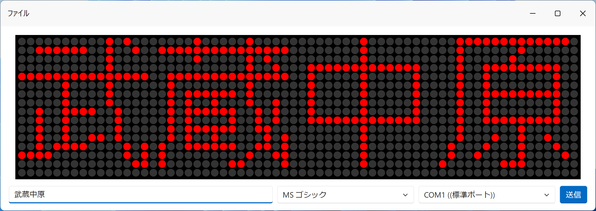

# dotmatrix-electron
[](https://github.com/Himeyama/dotmatrix-electron/actions/workflows/Build.yml)



このアプリは、[dotmatrix-arduino](https://github.com/Himeyama/dotmatrix-arduino) の制御をパソコンから行えます。

## 環境構築
- nodejs
- yarn

が必要です。

### 依存パッケージのインストール
```sh
yarn install
```

### アプリの実行
```sh
yarn run start
```

### パッケージ化
```sh
yarn run build
```